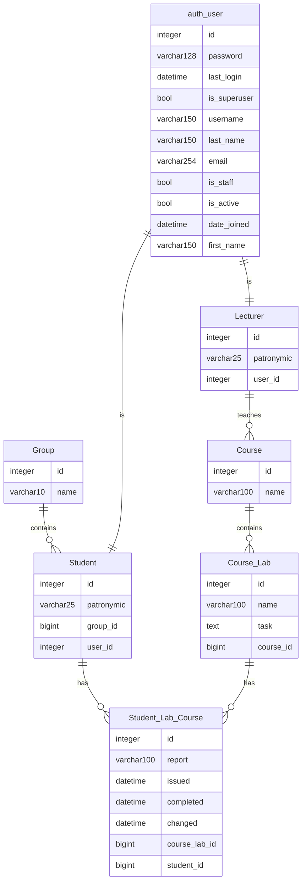

ER-диаграмма:

```mermaid
erDiagram
    Course {
        integer id
        varchar100 name
    }
    Lecturer {
        integer id
        varchar25 patronymic
        integer user_id
    }
    Course_Lab {
        integer id
        varchar100 name
        text task
        bigint course_id
    }
    Group {
        integer id
        varchar10 name
    }
    Student {
        integer id
        varchar25 patronymic
        bigint group_id
        integer user_id
    }
    Student_Lab_Course {
        integer id
        varchar100 report
        datetime issued
        datetime completed
        datetime changed
        bigint course_lab_id
        bigint student_id
    }
    auth_user {
        integer id
        varchar128 password
        datetime last_login
        bool is_superuser
        varchar150 username
        varchar150 last_name
        varchar254 email
        bool is_staff
        bool is_active
        datetime date_joined
        varchar150 first_name
    }
    Lecturer ||--o{ Course : teaches
    Course ||--o{ Course_Lab : contains
    Group ||--o{ Student : contains
    Student ||--o{ Student_Lab_Course : has
    Course_Lab ||--o{ Student_Lab_Course : has
    auth_user ||--|| Lecturer : is
    auth_user ||--|| Student : is
```